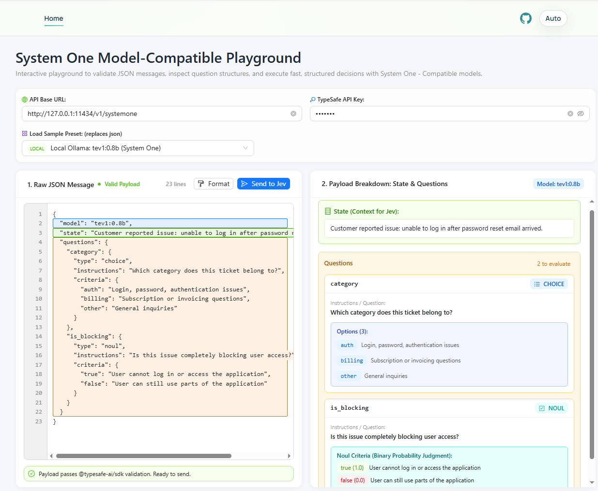
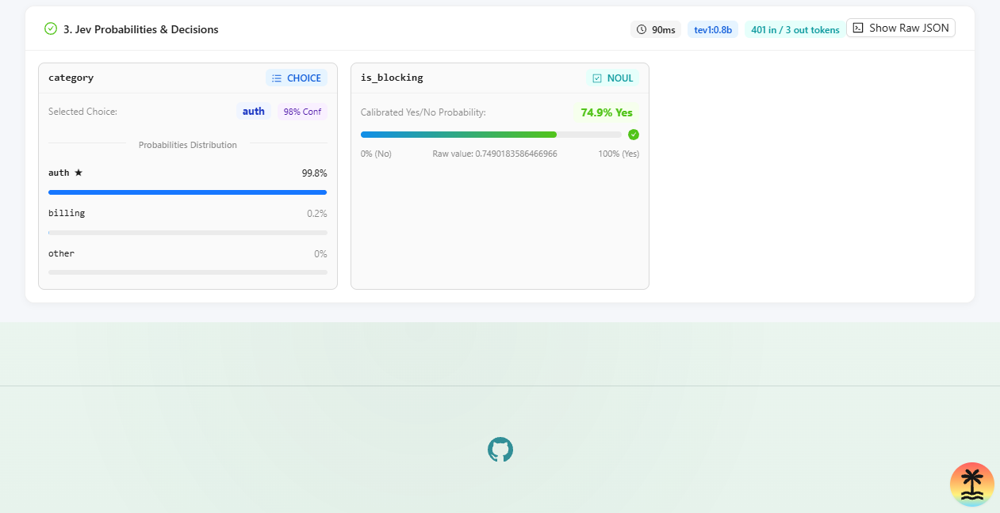

# System One - Model Compatible Playground

An interactive React frontend for experimenting with System One API specification for decision-based model executions like [TypeSafe AI's Jev model](https://typesafe.ai/blog/introducing-system-one-models-and-jev).

---

## Playground

### Inputs & Payload Breakdown



### Decisions & Probabilities



---

## Features

- **Raw JSON Message Input**: Directly input, edit, and format arbitrary System One request payloads.
- **Question Structure Breakdown**: Live visualizer that parses and displays:
  - **State**: The context provided to the model (free text or structured JSON data).
  - **Choice Questions**: Lists all available options and criteria descriptions.
  - **Noul Questions**: Displays binary propositions and optional `true`/`false` criteria definitions.
  - **Score Questions**: Lists rubric levels and scoring rubrics.
- **Payload Validation**: Validates schema and question primitives using types and rules from [@typesafe-ai/sdk](https://docs.typesafe.ai/sdk/javascript).
- **Parallel Decisions & Probabilities Display**: Visualizes calibrated probability distributions across options, yes/no confidence for nouls, latency benchmarks, and token usage.
- **Configurable Endpoints & In-Memory API Keys**: Easily switch between cloud TypeSafe endpoints and local Ollama instances without persisting keys in browser storage.
- **Sample Presets**: One-click preloaded payloads for Noul, Choice, Score, Combined multi-question workflows, and local Ollama models.

---

## Getting Started

### Prerequisites

- Node.js 20 or newer
- npm (or pnpm / yarn)
- (Optional) [Ollama](https://ollama.com/) for running local models

### Installation

Clone the repository and install dependencies:

```bash
npm install
```

### Running the Development Server

Start the TanStack Start development server:

```bash
npm run dev
```

Open [http://localhost:3000](http://localhost:3000) in your browser.

### Building for Production

To produce a production bundle powered by Nitro:

```bash
npm run build
```

Preview the production build:

```bash
npm run preview
```

Built with [TanStack Start](https://tanstack.com/start), [Ant Design](https://ant.design/), and the [@typesafe-ai/sdk](https://docs.typesafe.ai/sdk/javascript).

---

## Running with Local Ollama (`tev1:0.8b`)

You can run System One models completely offline using [Ollama](https://ollama.com/) with System One Compatible models like the `tev1:0.8b` model.

### 1. Pull and Run the Ollama Model

In your terminal, run the following command to download and start the model:

```bash
ollama run tev1:0.8b
```

By default, Ollama serves the local API on `http://localhost:11434`.

### 2. Configure the Playground

In the top configuration header of the playground, configure the following:

| Setting              | Value                                 | Description                                                                                                                  |
| -------------------- | ------------------------------------- | ---------------------------------------------------------------------------------------------------------------------------- |
| **API Base URL**     | `http://localhost:11434/v1/systemone` | You can enter `http://localhost:11434/v1/systemone` or `http://localhost:11434` (the server handler normalizes the endpoint) |
| **Model**            | `tev1:0.8b`                           | Specified in the JSON payload `model` field                                                                                  |
| **TypeSafe API Key** | `ollama` (or any string)              | Any placeholder value, since local Ollama does not require cloud authentication                                              |

### 3. Load the Local Preset

Click the **Load Sample Preset** dropdown in the header and choose **Local Ollama: tev1:0.8b (System One)**, or paste the following JSON message into the editor:

```json
{
  "state": "Customer reported issue: unable to log in after password reset email arrived.",
  "model": "tev1:0.8b",
  "questions": {
    "category": {
      "type": "choice",
      "instructions": "Which category does this ticket belong to?",
      "criteria": {
        "auth": "Login, password, authentication issues",
        "billing": "Subscription or invoicing questions",
        "other": "General inquiries"
      }
    },
    "is_blocking": {
      "type": "noul",
      "instructions": "Is this issue completely blocking user access?",
      "criteria": {
        "true": "User cannot log in or access the application",
        "false": "User can still use parts of the application"
      }
    }
  }
}
```

Click **Send to Jev** to evaluate your questions locally with zero cloud latency.

---

## Running with TypeSafe Cloud (`jev-latest`)

To evaluate against TypeSafe's hosted frontier model:

1. Obtain an API key from the [TypeSafe Console](https://console.typesafe.ai/).
2. In the playground header:
   - Set **TypeSafe API Key** to your key (e.g. `ts_...`).
   - Set **API Base URL** to `https://api.typesafe.ai` (default).
   - Use `jev-latest` (or `jev-1.13.0`) in your payload's `model` property.
3. Click **Send to Jev**.

---

## System One Primitives

Jev and System One models operate on structured states and return calibrated probability distributions rather than free-form conversational strings:

### Choice

Selects the single best option from a fixed set of named options (up to 255):

- **Request**: `type: "choice"`, `instructions`, and a `criteria` object mapping option labels to descriptions.
- **Response**: `choice` (highest-probability label), `confidence`, and `probabilities` distribution across all options.

### Noul

Answers a yes/no statement or proposition:

- **Request**: `type: "noul"`, `instructions`, and optional `criteria` specifying `true` and `false` definitions.
- **Response**: `noul` (a single calibrated float between 0.0 and 1.0 representing the probability that the proposition is yes/true).

### Score

Evaluates state against an ordered rubric (from 2 to 10 levels):

- **Request**: `type: "score"`, `instructions`, and a `criteria` array of ordered level descriptions.
- **Response**: `score` (expected continuous score position), `confidence`, `legend`, and `probabilities` distribution per level.

---

## Project Structure

- [src/routes/index.tsx](src/routes/index.tsx): Main playground page coordinating the editor, visualizers, and state.
- [src/components/HeaderConfig.tsx](src/components/HeaderConfig.tsx): API key, endpoint base URL, and preset selection bar.
- [src/components/JsonEditor.tsx](src/components/JsonEditor.tsx): Monospace JSON textarea with formatting, validation alerts, and submission controls.
- [src/components/QuestionVisualizer.tsx](src/components/QuestionVisualizer.tsx): Breakdown of state, question types, criteria, and options.
- [src/components/ResponseVisualizer.tsx](src/components/ResponseVisualizer.tsx): Renders calibrated probability bars, confidence ratings, token metrics, and raw response JSON.
- [src/services/validation.ts](src/services/validation.ts): Schema validator using TypeSafe primitives and rules.
- [src/services/presets.ts](src/services/presets.ts): Preloaded example request payloads for quick experimentation.
- [src/server/jev.ts](src/server/jev.ts): TanStack Start server function relaying calls via [@typesafe-ai/sdk](https://docs.typesafe.ai/sdk/javascript).

---

## Documentation & References

- [TypeSafe AI Blog: Introducing System One Models and Jev](https://typesafe.ai/blog/introducing-system-one-models-and-jev)
- [TypeSafe Documentation](https://docs.typesafe.ai/)
- [TypeSafe JavaScript SDK Documentation](https://docs.typesafe.ai/sdk/javascript)
- [Ollama Model Library](https://ollama.com/library)
- [TanStack Start Documentation](https://tanstack.com/start)
